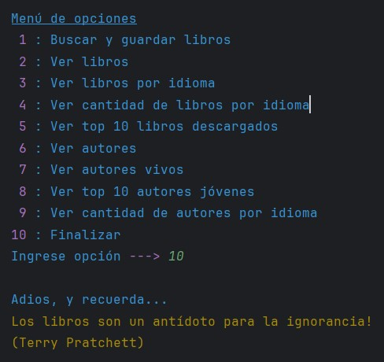

<h1 align="center">LiterAlura</h1>

 

## Índice de Contenidos:
---
- [Contexto](#contexto)
- [Guía de Usuario](#guía-de-usuario)
- [Guía de Instalación](#guía-de-instalación)
- [Autor](#autor)
- [Licencia](#licencia)
- [Agradecimientos](#agradecimientos)
- [Documentos Complementarios](#documentos-complementarios)

## Contexto
---

LiterAlura es una aplicación desarrollada en Java con el entorno IntelliJ para el Challenge del curso &quot;Java Persistencia de Datos y Consultas con Spring Data JPA&quot; de ONE + Alura Latam. Ha sido manufacturada por su autor (sin ayuda de IA) en Octubre de 2024.

&#8593; <a href="#readme-indice">Índice</a> &#8593; <a href="#readme-inicio">Inicio</a> &#8593;

## Guía de Usuario
---
Esta aplicación permite consumir la información JSON provista por la API de Gutendex y persistirla en una base de datos relacional PostgreSQL para su posterior explotación. (Para asegurar la consistencia, se utilizan transacciones en los bloques <code>try-catch-finally</code>).

El modelo de datos se basa en tres tablas: <code>libros</code>, <code>autores</code> e <code>idiomas</code>. Entre la primera y las otras existen relaciones <code>@ManyToMany</code>, lo cual implica la existencia de dos tablas más: <code>libros_autores</code> y <code>libros_idiomas</code>.

Las opciones del menú son las siguientes:
* Buscar y guardar libros
* Ver libros
* Ver libros por idioma
* Ver cantidad de libros por idioma
* Ver top 10 libros descargados
* Ver autores
* Ver autores vivos
* Ver top 10 autores jóvenes
* Ver cantidad de autores por idioma

A continuación, unas muestras de su interfaz:

<table align="center" style="border:0">
<tr>
<td align="left"></td>
<td align="left"></td>
</tr>
<tr>
<td align="left"></td>
<td align="left"></td>
</tr>
<tr>
<td align="left"></td>
<td align="left"></td>
</tr>
</table>

&#8593; <a href="#readme-indice">Índice</a> &#8593; <a href="#readme-inicio">Inicio</a> &#8593;

## Guía de Instalación
---
Simplemente se requiere clonar este proyecto en el repositorio local, y luego ejecutarlo con un IDE acorde (como IntelliJ, Eclipse, etc) desde el método <code>main</code> de la clase <code>LiterAluraApplication</code>.

Dado que la aplicación trabaja con una base de datos, se requiere un servidor PostgreSQL 16.4.2 o superior previamente instalado. (Se proveen scripts SQL de ayuda, incluso con el universo de datos al 25/Oct/2024).

Además, como es necesario acceder a Internet para ejecutar la API de Gutendex, tanto antivirus como cortafuegos no deben limitar ni bloquear dicho comportamiento.

Importante: No olvidar declarar las variables de entorno que se utilizan en <code>application.properties</code>.

## Autor
---
César es alumno de Alura. Inició su formación en Junio de 2024 dentro del plan Oracle Next Education para Latinoamérica. Tiene 54 años y es nacido en Buenos Aires.

&#8593; <a href="#readme-indice">Índice</a> &#8593; <a href="#readme-inicio">Inicio</a> &#8593;

## Licencia 
---
Licencia BSD Zero Clause (0BSD) detallada en <code>LICENSE.txt</code> en la raíz del repositorio. Más información en https://opensource.org/license/0bsd

&#8593; <a href="#readme-indice">Índice</a> &#8593; <a href="#readme-inicio">Inicio</a> &#8593;

## Agradecimientos 
---
* Generador de logotipo : https://chatgpt.com
* Generador de favicon : https://favicon.io

&#8593; <a href="#readme-indice">Índice</a> &#8593; <a href="#readme-inicio">Inicio</a> &#8593;

## Documentos Complementarios
---
* Clonar un repositorio de GitHub : https://docs.github.com/es/repositories/creating-and-managing-repositories/cloning-a-repository
* Scripts SQL de base de datos :  https://github.com/cesargh/literalura/tree/master/sql
* Sito Web Oficial de PostgreSQL : https://www.postgresql.org
* API Gutendex : https://gutendex.com

&#8593; <a href="#readme-indice">Índice</a> &#8593; <a href="#readme-inicio">Inicio</a> &#8593;

